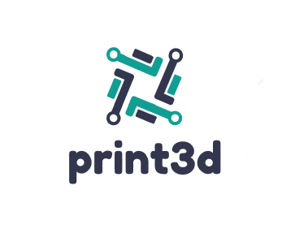
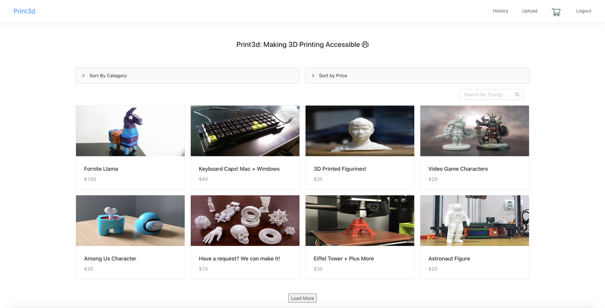

<h1 align="center">
   
  
   
</h1>

<h4 align="center">print3d is an online e-commerce marketplace for 3D printing and design. Browse the site to purchase 3D prints/designs or post some of your models that are ready to be purchased.</h4>

  
  
  

  <!-- <a href=""> Site </a> • -->
  <a href="#key-features">Key Features</a> •
  <a href="#tech-stack">Tech Stack</a> •
  <a href="#developers">Developers</a>

## Key Features

* Payment through PayPal
  - print3d has the ability to complete purchases made using PayPal
* Search and Filter for Products
  - Filter by product specifications and price
* User Settings Page
  - Detailed user settings page with payment history, products on wish list, etc. 

## Tech Stack 

* React.js
* Node.js
* Express.js
* MongoDB

## Developers

<a href="https://github.com/hunnain-atif">Hunnain Atif</a> • <a href="https://github.com/GobishanVijikaran">Gobishan Vijikaran</a> 

